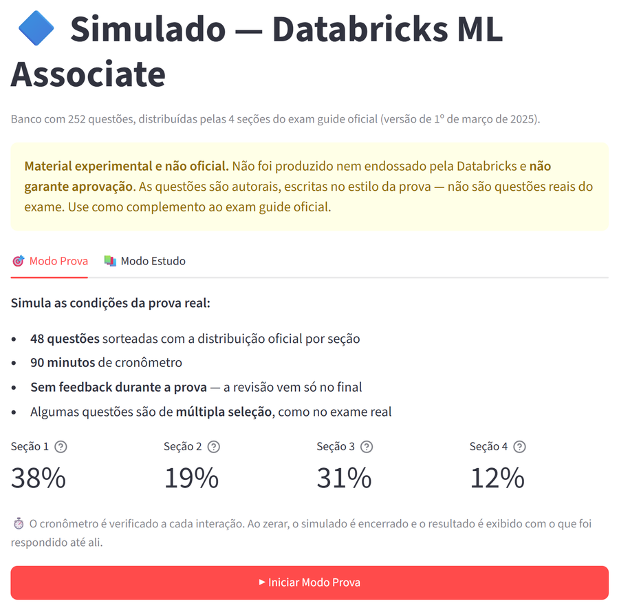

# Databricks Certified Machine Learning Associate — Guia de Estudos

> Guia prático e incremental para passar na certificação Databricks ML Associate do zero.
> Cada módulo tem teoria mínima + código completo para rodar no Databricks.
> Um projeto de **previsão de churn de clientes** conecta todos os módulos do início ao fim.

---

## Sobre a Certificação

- **Formato:** ~45 questões de múltipla escolha, 90 minutos
- **Aprovação:** ~70% de acerto
- **Pré-requisito:** Python básico e noções de ML (sklearn, pandas)
- **Guia oficial:** https://www.databricks.com/learn/certification/machine-learning-associate

### Distribuição de Tópicos

| Domínio | Peso |
|---|---|
| MLflow (tracking, registry, modelos) | ~25% |
| Spark ML (pipeline, treinamento, avaliação) | ~20% |
| Exploração e preparação de dados | ~18% |
| Feature Engineering | ~12% |
| AutoML e Deployment | ~13% |
| Feature Store | ~12% |

---

## O Projeto Fio Condutor

Todos os módulos usam o mesmo problema real:

> **Previsão de Churn de Clientes de Telecom**
> Uma empresa de telefonia quer prever quais clientes cancelarão o serviço nos próximos 30 dias para que o time comercial aja preventivamente.

O dataset é criado programaticamente no Módulo 2 e reutilizado em todos os módulos seguintes.

---

## Módulos

| # | Arquivo | Conteúdo | Tempo estimado |
|---|---|---|---|
| 0 | [modulos/00_configuracao.md](modulos/00_configuracao.md) | Criar conta gratuita, cluster, primeiro notebook | 30 min |
| 1 | [modulos/01_plataforma.md](modulos/01_plataforma.md) | Clusters, Unity Catalog & Volumes, Delta Lake, dbutils | 1h |
| 2 | [modulos/02_pyspark.md](modulos/02_pyspark.md) | DataFrames, transformações, EDA, lazy evaluation | 2h |
| 3 | [modulos/03_mlflow.md](modulos/03_mlflow.md) | Tracking, autolog, experiments, Model Registry | 3h |
| 4 | [modulos/04_feature_engineering.md](modulos/04_feature_engineering.md) | Pipeline Spark ML, encoders, scalers, imputadores | 2h |
| 5 | [modulos/05_treinamento_modelos.md](modulos/05_treinamento_modelos.md) | Spark MLlib, avaliadores, cross-validation | 2h |
| 6 | [modulos/06_hyperopt.md](modulos/06_hyperopt.md) | Busca Bayesiana, SparkTrials, integração MLflow | 1.5h |
| 7 | [modulos/07_automl.md](modulos/07_automl.md) | Classificação, regressão, forecasting, output | 1h |
| 8 | [modulos/08_feature_store.md](modulos/08_feature_store.md) | Criar features centralizadas, FeatureLookup, score_batch | 1.5h |
| 9 | [modulos/09_deployment.md](modulos/09_deployment.md) | Batch inference, pyfunc, Model Serving | 1.5h |
| 10 | [modulos/10_topicos_extras.md](modulos/10_topicos_extras.md) | Data leakage, deep learning, métricas, checklist final | 1h |

---

## Simulados

O sistema de simulados está em [`simulados/`](simulados/).

**Demo online:** https://databricks-ml-ass-prep.streamlit.app/



Para rodar localmente:

```bash
pip install -r simulados/requirements.txt
streamlit run simulados/quiz.py
```

**Funcionalidades:**
- 105 questões cobrindo todos os módulos (distribuídas por dificuldade e módulo)
- Filtro por módulo, dificuldade e número de questões
- Alternativas embaralhadas a cada sessão
- Feedback imediato com explicação
- Relatório final com desempenho por módulo e lista de revisão

---

## Plano de Estudos — 6 Semanas

| Semana | Módulos | Meta |
|---|---|---|
| **1** | 0 + 1 + 2 | Ambiente configurado, dominar PySpark |
| **2** | 3 (MLflow) | Experimento completo, modelo no Registry em Production |
| **3** | 4 + 5 | Pipeline feature eng + training com Spark ML |
| **4** | 6 + 7 + 8 | Hyperopt tuning + AutoML + Feature Store |
| **5** | 9 + 10 | Deployment + revisão do checklist final |
| **6** | Simulados | Simulados diários + revisar módulos com menor score |

> **Regra de ouro:** Se o tempo for curto, priorize o **Módulo 3 (MLflow)** e o **Módulo 5 (Spark ML)**. Juntos valem ~45% da prova.

---

## Recursos Oficiais

| Recurso | Link |
|---|---|
| Exam Guide | https://www.databricks.com/learn/certification/machine-learning-associate |
| Databricks Academy (gratuito) | https://academy.databricks.com |
| Documentação MLflow | https://mlflow.org/docs/latest |
| Documentação Spark ML | https://spark.apache.org/docs/latest/ml-guide.html |
| Free Edition (conta grátis) | https://www.databricks.com/learn/free-edition |
